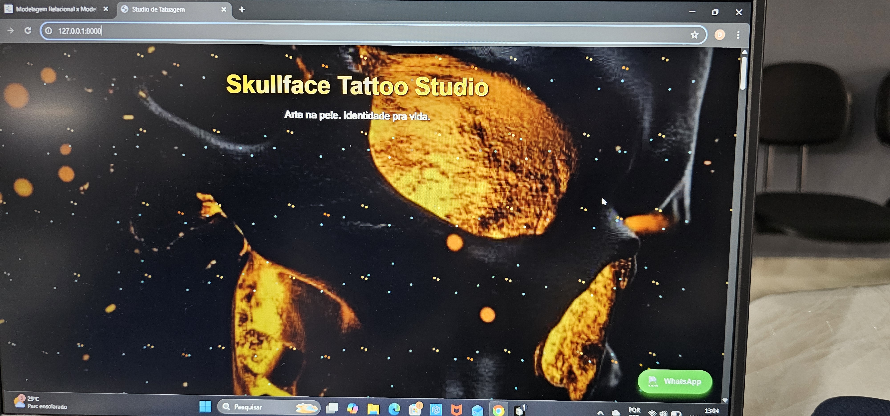
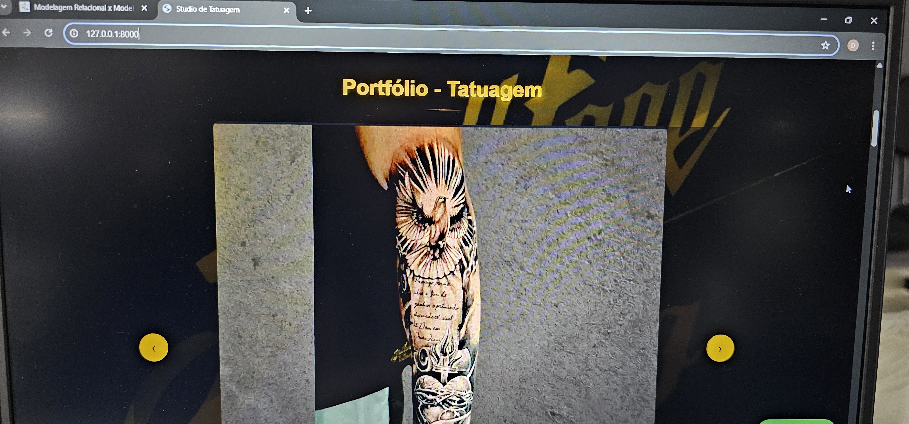
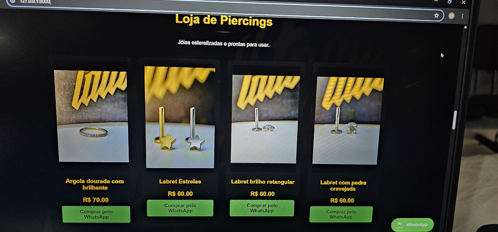

# Skull Face Tattoo Studio – Website Profissional

Website desenvolvido para um estúdio de tatuagem com foco em apresentação de portfólio, gestão de conteúdo e catálogo de produtos.

🚀 Sobre o projeto
Este projeto foi desenvolvido com Django para simular um sistema real utilizado por um estúdio de tatuagem, incluindo:

Exibição de portfólio de tatuagens
Catálogo de piercings com valores
Integração com WhatsApp para contato direto
Avaliações de clientes (Google Reviews)
Painel administrativo completo para gerenciamento
O objetivo foi criar uma aplicação funcional, responsiva e próxima de um ambiente real de produção.

🛠️ Tecnologias utilizadas
Python
Django
SQLite
HTML5
CSS3
JavaScript
Cloudinary (armazenamento de imagens)
Whitenoise (arquivos estáticos)
⚙️ Funcionalidades
📸 Galeria dinâmica de tatuagens (com filtros por estilo)
💎 Catálogo de piercings com preço e descrição
🛒 Estrutura inicial de e-commerce
📱 Layout responsivo (mobile e desktop)
🔍 Lightbox com navegação entre imagens
⭐ Integração com avaliações do Google
💬 Botão de contato direto via WhatsApp
🧑‍💼 Painel administrativo Django para gestão completa
🧠 Arquitetura do projeto
O projeto segue a arquitetura padrão do Django (MTV):

Models: Estrutura do banco de dados (produtos, trabalhos, estilos, etc.)
Views: Lógica de negócio e renderização
Templates: Interface do usuário (HTML)
Static / Media: Arquivos estáticos e imagens
📂 Estrutura do projeto
studio/
├── core/
├── templates/
├── static/
├── media/
├── manage.py

📸 Demonstração

🔐 Funcionalidades administrativas
O sistema conta com painel admin do Django, permitindo:

Adicionar / editar / remover tatuagens
Gerenciar piercings e valores
Organizar estilos
Atualizar conteúdo do site em tempo real
📈 Aprendizados
Durante o desenvolvimento deste projeto foram aplicados:

Estruturação completa de projeto Django
Modelagem de banco de dados relacional
Integração com serviços externos (Cloudinary, Google)
Criação de interface responsiva
Deploy e configuração de ambiente de produção
📌 Status do projeto
✔ Funcional e em uso como portfólio
🔄 Em constante melhoria

📞 Contato
Projeto desenvolvido por Doug
📧 [danieldougtattoo@gmail.com]
